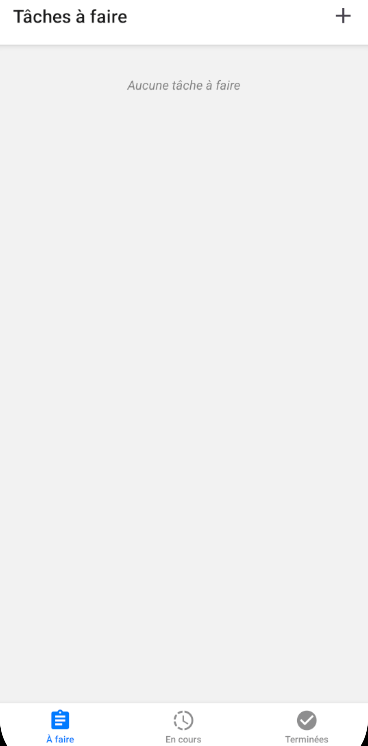
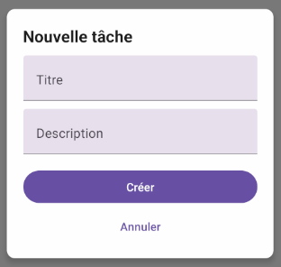
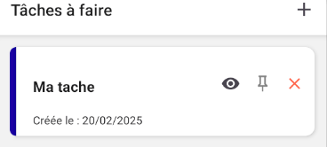
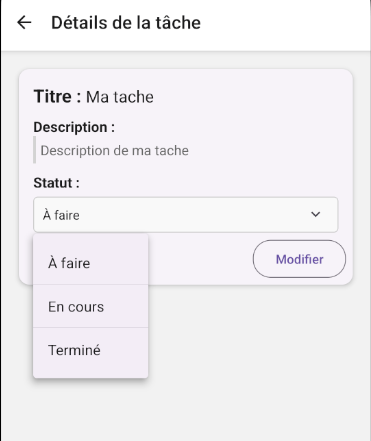
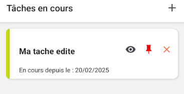
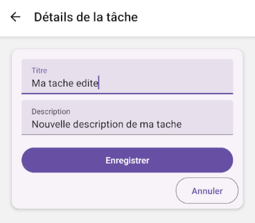
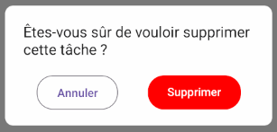

# ToDoList

ToDoList est une application mobile développée en React-Native. Elle permet de tenir à jour votre liste de tâches "A faire", "En cours" et "Terminées".

## Documentation

### 📱 Navigation

À l'ouverture de l'application, l'écran d'accueil est l'onglet des tâches "À faire".

    

Il est possible de se déplacer entre les 3 onglets, "À faire", "En cours" et "Terminées", grâce à la barre de navigation en bas de l'écran.

### ➕ Ajout d'une tâche

Depuis chaque onglet, il est possible créer une nouvelle tâche grâce au bouton "+" situé en haut à droite de l'écran.

    

Deux données obligatoires, le titre et la description, doivent être saisies pour créer cette nouvelle tâche.

    

 

A sa création, la nouvelle tâche se retrouve dans l'onglet "À faire".

    

 

### ✏️ Modification d'une tâche

Les détails d'une tâche peuvent être consultés en cliquant sur l'icône d'oeil  à droite de la tâche. Un nouvel écran apparait alors avec les détails de la tâche. Il est ici possible de modifier le statut de la tâche entre "A faire", "En cours" et "Terminées".

    

Lorsqu'un nouveau statut est sélectionné, la tâche est instantannément déplacée dans l'écran correspondant.

    

Il est également possible de modifier les détails de la tâche en cliquant sur le bouton "Modifier", puis en cliquant sur le bouton "Enregistrer".

    

### 📌 Mise en avant d'une tâche

En cliquant sur l'icône de punaise  à droite de la tâche, elle est remontée tout en haut de la liste des tâches. Pour retirer la tâche épinglée, il suffit de re-cliquer sur l'icône de punaise . Attention, qu'une seule tâche peut-être épinglée à la fois. Si une autre tâche est épinglée, alors la précédente ne le sera plus et retrouvera sa place antérieur dans la liste.

### ❌ Suppression d'une tâche

À tout moment, une tâche peut être supprimée simplement en cliquant sur la croix  à droite de la tâche. Il suffit en suite de confirmer la suppression en cliquant sur le bouton "Supprimer".

    

## Demo

[Testez-la vous même](https://expo.dev/accounts/dadidodz/projects/ToDoList/updates/38bb3f15-ee24-4815-a102-b88552f21362)

